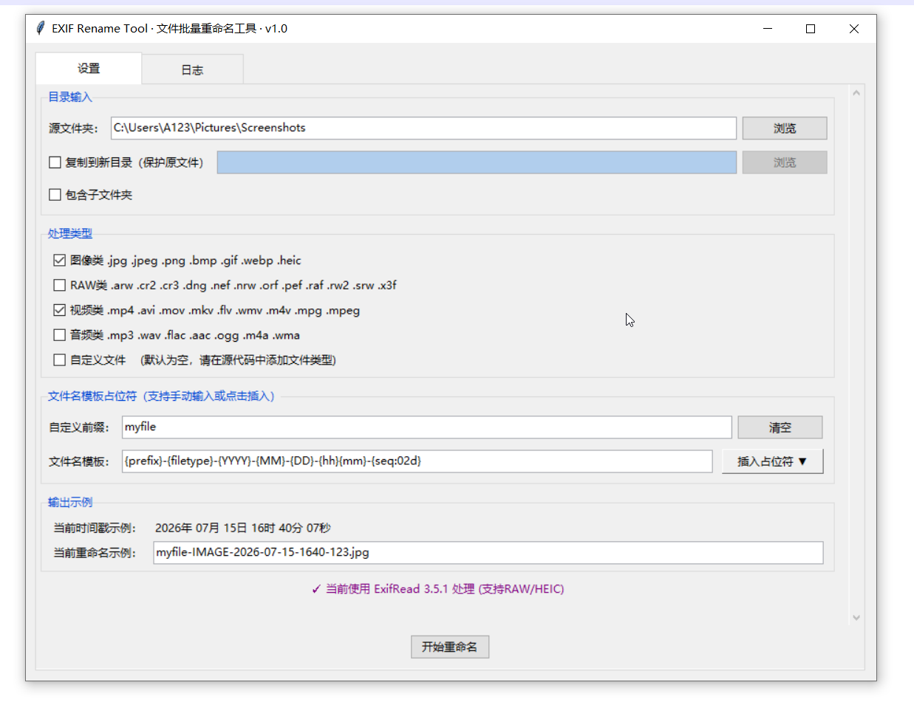
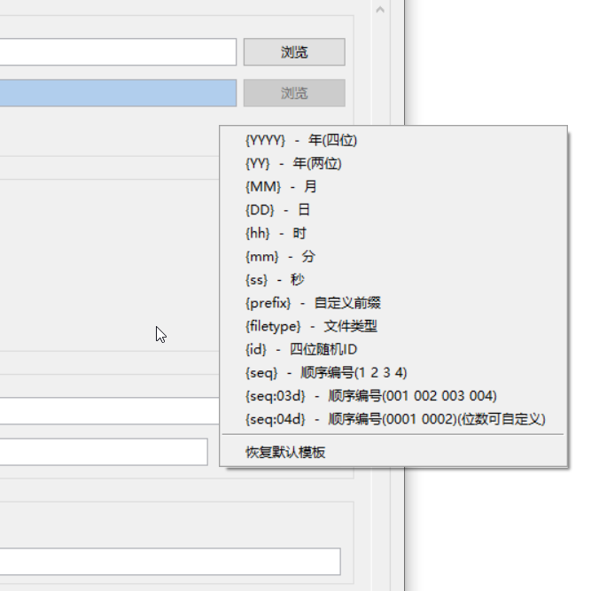
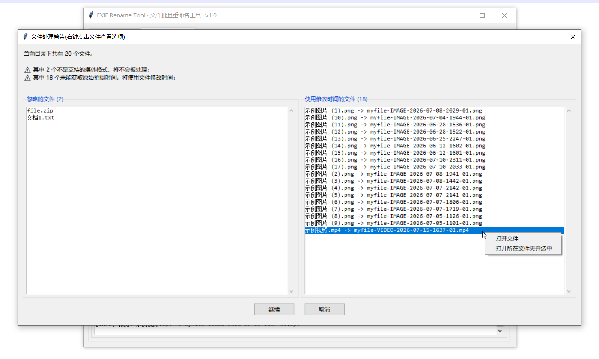
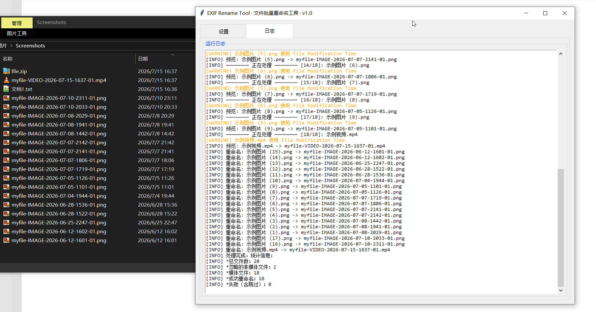

# Rename Tool · 文件批量重命名工具

> 基于 EXIF 拍摄日期与自定义模板的媒体文件批量重命名工具。  
> 支持图片（含 RAW）、视频、音频等文件类型，全 GUI 交互，后台多线程处理。

---

## 为什么做这个工具

我平时有拍照归档的习惯，但照片来源五花八门——相机直出、手机拍摄、社交平台保存……它们的原文件名千奇百怪，混在一起非常混乱，既不便于归档，日后查找也极为痛苦。所以就有了这个小工具。

它能**自动读取照片的真实拍摄时间**（EXIF），再按照你自定义的命名模板**批量重命名**，让混乱的文件名变得整齐、可读、可检索。

<p align="center">
  <br>
  <sub style="color: #888;">主界面</sub>
</p>

<p align="center">
  <br>
  <sub style="color: #888;">命名占位符列表</sub>
</p>

<p align="center">
  <br>
  <sub style="color: #888;">执行前确认弹窗</sub>
</p>

<p align="center">
  <br>
  <sub style="color: #888;">重命名完成统计结果</sub>
</p>

---

## 功能概览

| 功能               | 说明                                    |
|------------------|---------------------------------------|
| 📷 **EXIF 日期读取** | 自动读取 EXIF 拍摄时间（支持`exifread`和`PIL`双引擎） |
| 🎨 **自定义模板**     | 自由组合日期、序号、ID 等占位符，即时预览效果              |
| 🖼️ **多文件类型**    | 支持常见图片（含 RAW/HEIC）、视频、音频文件            |
| 📂 **子文件夹递归**    | 支持子文件夹递归处理，保留目录结构                     |
| 📑 **复制模式**      | 原文件不删除，输出到新目录                         |
| ☑️ **多层确认**      | 执行前提示警告 + 预览列表，防止误操作                  |
| 🔎 **右键操作**      | 可通过右键文件打开文件 / 在资源管理器中定位               |
| 💾 **后台处理**      | 耗时操作在后台线程执行，界面不卡顿                     |
| 📝 **实时日志**      | 每一步操作都有详细日志，失败文件单独高亮提醒                |


---

## 下载与使用

### 环境要求

- Python 3.10+
- 操作系统：Windows（完整支持）/ macOS / Linux（基础支持）

### 安装依赖

```bash
pip install Pillow
pip install exifread
```

> - `Pillow` 为**必需依赖**，用于基础 EXIF 读取。  
> - `exifread` 为推荐依赖，可提升 RAW 和 HEIC 的 EXIF 解析精度，不安装仍可使用`Pillow` 读取基础 EXIF。

### 运行

```bash
python rename_tool.py
```

### 快速上手

1. 选择源文件夹（默认系统截图目录）
2. （可选）勾选“复制到新目录”并选择目标文件夹
3. 勾选要处理的文件类型（图片、视频等）
4. （可选）编辑文件名模板（或点击“插入占位符”快速构建）
5. 点击“开始重命名”，确认警告和预览，等待完成

---

## 功能说明

### 1. 文件类型支持

工具按扩展名识别文件类型，用户可在界面中勾选要处理的类型。

| 类型        | 支持扩展名                                                                               |
|-----------|-------------------------------------------------------------------------------------|
| **图像**    | `.jpg` `.jpeg` `.png` `.bmp` `.gif` `.webp` `.heic`                                 |
| **相机RAW** | `.arw` `.cr2` `.cr3` `.dng` `.nef` `.nrw` `.orf` `.pef` `.raf` `.rw2` `.srw` `.x3f` |
| **视频**    | `.mp4` `.avi` `.mov` `.mkv` `.flv` `.wmv` `.m4v` `.mpg` `.mpeg`                     |
| **音频**    | `.mp3` `.wav` `.flac` `.aac` `.ogg` `.m4a` `.wma`                                   |
| **自定义**   | 默认为空，可根据需要在源代码中 `CUSTOM_FILE_EXTS` 处添加                                              |

> 系统文件（`desktop.ini`、`thumbs.db`、`.DS_Store` 等）和隐藏文件（以 `.` 或 `$` 开头）自动忽略，不会被处理。

---

### 2. 拍摄日期提取

工具按优先级自动提取：**`exifread` 解析 `DateTimeOriginal`（最准确）→ XMP 元数据（含侧边 `.xmp`）→ PIL 回退读取 → 文件修改时间**。

> 💡 日期解析支持多种格式：`YYYY:MM:DD HH:MM:SS`、`YYYY-MM-DD HH:MM:SS`、`YYYY/MM/DD`、ISO 8601 等，自动去除时区偏移。

> 💡 强烈建议安装 `exifread`（`pip install exifread`），以提升 RAW 和 HEIC 的 EXIF 解析精度。

---

### 3. 文件名模板系统

支持**自由组合**占位符（在界面中通过 **「插入占位符 ▼」** 菜单快速插入）：

_示例输出基于 `2026年7月5日 14:30:45` 生成_

| 占位符（组合示例）             | 含义                  | 示例输出                                |
|-----------------------|---------------------|-------------------------------------|
| `{YYYY}-{MM}-{DD}`    | 年-月-日（年份可选两位`{YY}`） | `2026-07-05`或`26-07-05`             |
| `{hh}-{mm}-{ss}`      | 时-分-秒（24小时制）        | `14-30-45`                          |
| `{prefix}`            | 自定义前缀               | 用户输入                                |
| `{filetype}`          | 文件类型标签              | `IMAGE` / `RAW` / `VIDEO` / `AUDIO` |
| `{id}`                | 四位随机字母+数字           | `A1B2`                              |
| `{seq}` / `{seq:04d}` | 顺序编号（补零位数可自定义）      | `1、2、…` / `0001、0002、…`             |

**示例：模板 `{prefix}-{YYYY}-{MM}-{DD}-{id}` → 生成 `screenshot-2026-07-05-A1B2.jpg`**

> 💡 日期时间占位符（{YYYY}、{YY}、{MM}、{DD}、{hh}、{mm}、{ss}）均可独立使用，**按需自由组合**。  
> 未识别的占位符会被自动移除，非法字符（`\ / : * ? " < > |`）会自动替换为下划线。 

---

### 4. 安全的复制模式

- **复制保护**：勾选“复制到新目录”后，文件复制输出，源文件完整保留。
- **智能冲突**：文件名重复时自动递增序号或追加后缀，确保无一覆盖。
- **多层确认**：执行前分别弹出“异常文件警告”（非媒体文件/读取日期失败文件）和“完整重命名对照表”，支持右键打开/定位文件，确认后开始执行重命名。

---

## 常见问题（FAQ）

### Q1：处理过程中界面响应变慢？

这是正常现象。工具使用多线程，但日志刷新和对话框轮询仍在主线程进行。  
如果文件数量极大（>10,000），日志输出密集时界面可能会有短暂停顿。可等待处理完成，或分批处理。

### Q2：某些照片的日期不对？

检查是否安装了 `exifread`。部分手机拍摄的照片或社交平台下载的图片可能不包含标准 EXIF，此时工具会回退到文件修改时间。可以：

1. 安装 `exifread`：`pip install exifread`
2. 确认照片本身包含 EXIF（可通过右键→属性→详细信息查看）
3. 对于确实没有 EXIF 的照片，工具会使用文件修改时间

### Q3：能支持更多的 RAW 格式吗？

目前支持的 RAW 格式涵盖主流相机品牌（索尼 .arw、佳能 .cr2/.cr3、尼康 .nef/.nrw、富士 .raf、奥林巴斯 .orf、宾得 .pef、理光 .rw2、适马 .x3f 等）。如需添加更多格式，可在源代码的 `RAW_EXTS` 元组中添加。

### Q4：多个文件重命名后出现相同的名字怎么办？

工具会自动处理文件名冲突：
- 如果模板包含 `{seq}` 占位符，会自动递增序号确保唯一（如 `photo_001.jpg`、`photo_002.jpg`）
- 如果模板不含 `{seq}`，则自动追加数字后缀（如 `photo.jpg`、`photo_2.jpg`、`photo_3.jpg`）
- 重试上限高达 10000 次，足以应对绝大多数场景

---

## 免责声明

本项目为个人学习作品，代码质量未经严格测试，部分逻辑及代码由 AI 辅助生成，不提供任何明示或暗示的保证，**不建议在生产环境或未备份的重要数据上使用**。使用前请务必备份原始数据，作者不对因使用本工具造成的任何数据丢失或损坏承担责任。

---

*部分内容及代码由AI生成，请注意甄别*  
*Vibe Coding with DeepSeek & AstrBot*
